# PromptBase

Organizational prompt-pack platform. Compiles modular markdown instruction packs into per-request system prompts, routes to multiple LLM providers, and delivers structured Word/PDF output — per team, per model, per task.

Chat UI is the delivery surface. The product is the **compiler**.

---

## Problem

Organizations need AI that follows *their* rules — engineering standards, sales playbooks, compliance checklists, internal terminology — consistently across every conversation, every team, every model. The current options all fail:

- **ChatGPT / Claude Projects:** one freeform system prompt textbox per project. No layering, no team isolation, no domain routing, no token budget visibility.
- **Open WebUI / chat front-ends:** great chat, but system prompt is per-model, not per-team, and there's no concept of multi-module instruction packs.
- **DIY prompt sprawl:** instructions copied into individual chats, drifting between teammates, impossible to version, no enforcement.

The actual organizational instruction set is not one prompt — it's 20–30 markdown documents (project overview, capability map, domain frameworks, mode-specific guidance). Stuffing all of that into one system prompt blows the context window. Loading only some of it manually is what humans currently do, and it's the failure point.

## Goal

Build the missing layer between the model and the chat UI:

1. **Modular prompt packs** — 25+ markdown modules with frontmatter (layer, priority, tags), versioned per team.
2. **Per-request compilation** — every message triggers a fresh assembly: core layer always loaded, domain modules conditionally loaded by keyword match, mode-specific overlay added by intent classifier, uploaded docs injected, total trimmed to fit the target model's context window by priority.
3. **Multi-team, multi-provider** — each team picks its pack + LLM provider (Ollama, OpenAI, Anthropic, OpenRouter) + model independently. Same user, multiple teams, no cross-bleed.
4. **Structured output delivery** — markdown responses converted to DOCX/PDF with team styling, because that's how the organization actually consumes the output.

The differentiator is the compiler, not the chat. *"How do you make AI consistently follow a multi-file instruction framework across teams and models with auto-routing per message?"*

---

## TL;DR

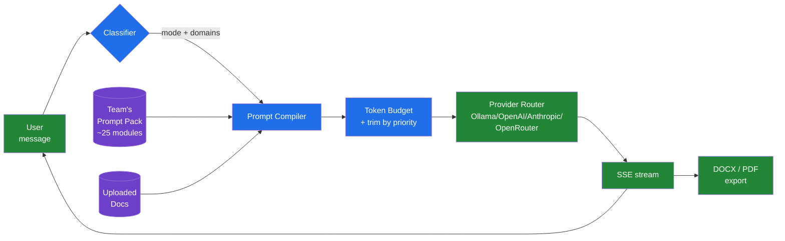

---

## System Architecture

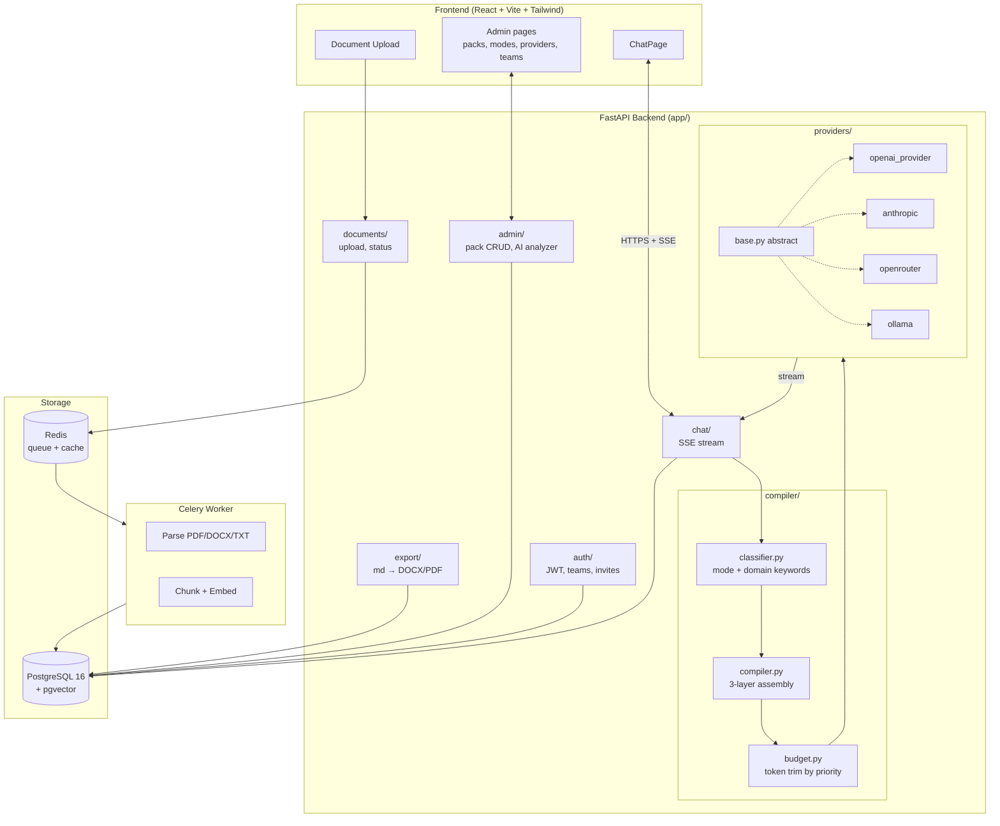

---

## The Prompt Compiler

The unique part. Each chat turn rebuilds a fresh system prompt from the team's pack.

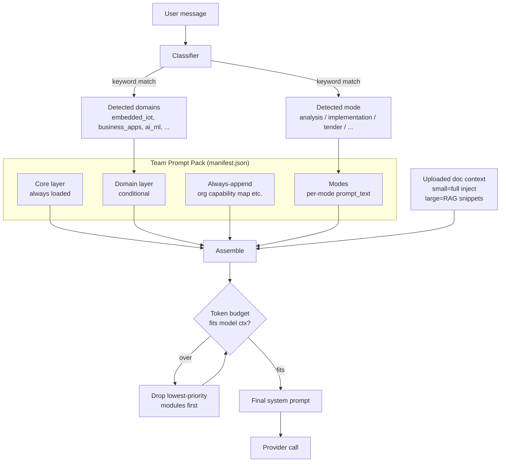

Module frontmatter drives the compiler:

```markdown
---
title: Embedded IoT Framework
tags: [plc, firmware, sensor, modbus]
priority: 80
layer: domain        # core | domain | always_append
---
```

---

## Document Pipeline

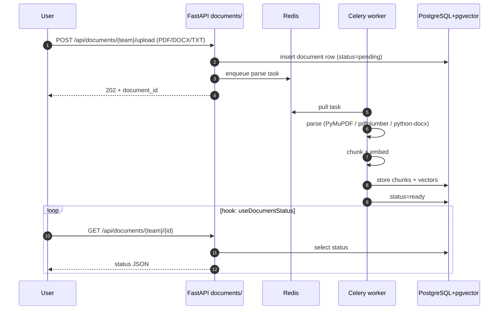

At chat time:
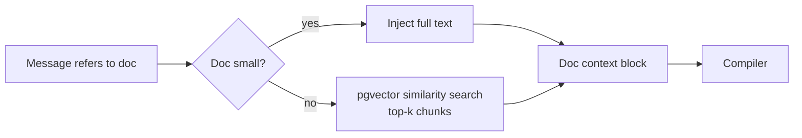

---

## Multi-Team Isolation

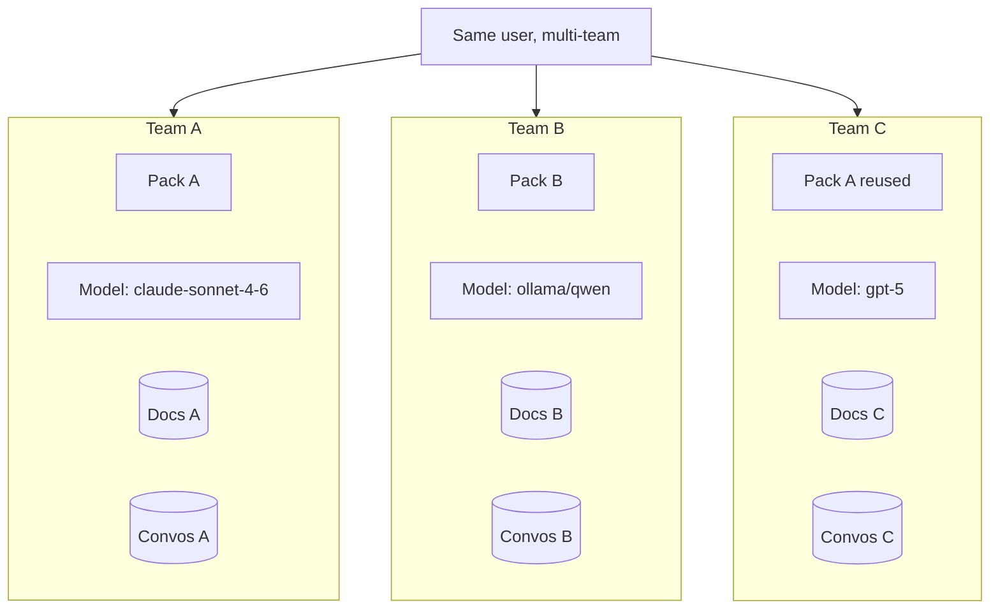

Each team has independent: pack assignment, LLM provider+model config, document library, conversation history.

---

## Provider Routing

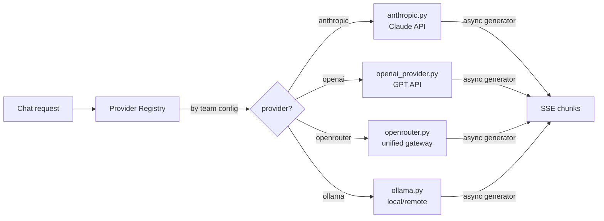

Each provider implements the same `base.py` interface: `stream(messages, model, **kwargs) -> AsyncIterator[str]`. Adding a provider = one new file + register.

---

## Export Pipeline

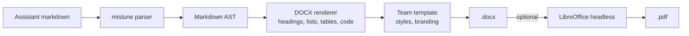

---

## Screenshots

| | |
|---|---|
| **Chat with streaming response (Engineering team)** | **LLM provider registry** |
| 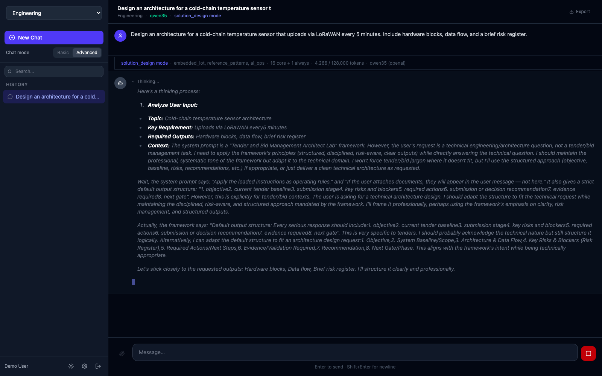 | 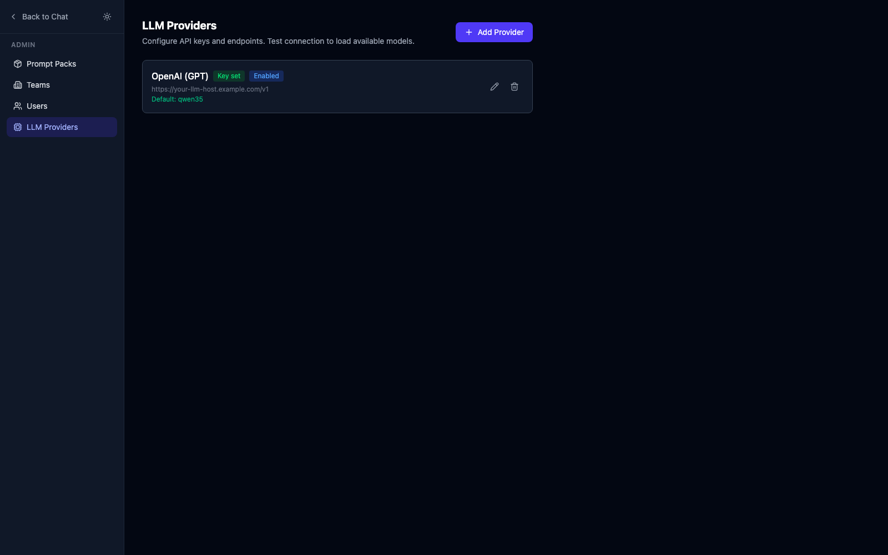 |
| **Prompt pack admin — 11 packs, 296 modules** | **Team config — pack assignment + LLM model** |
| 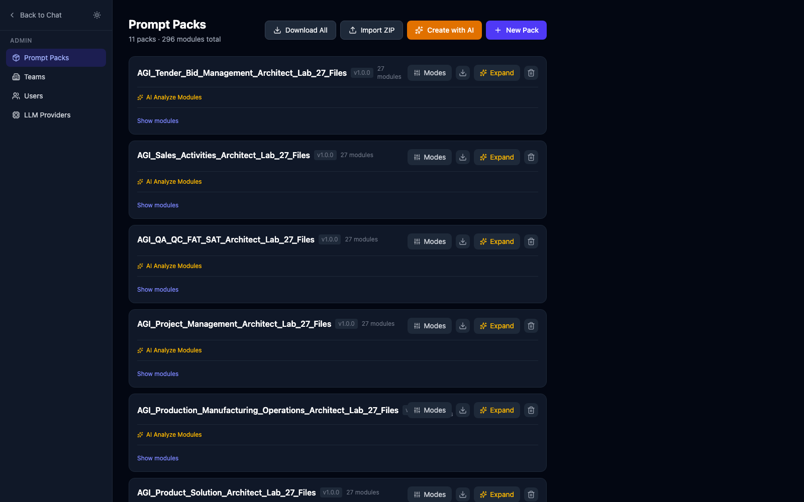 | 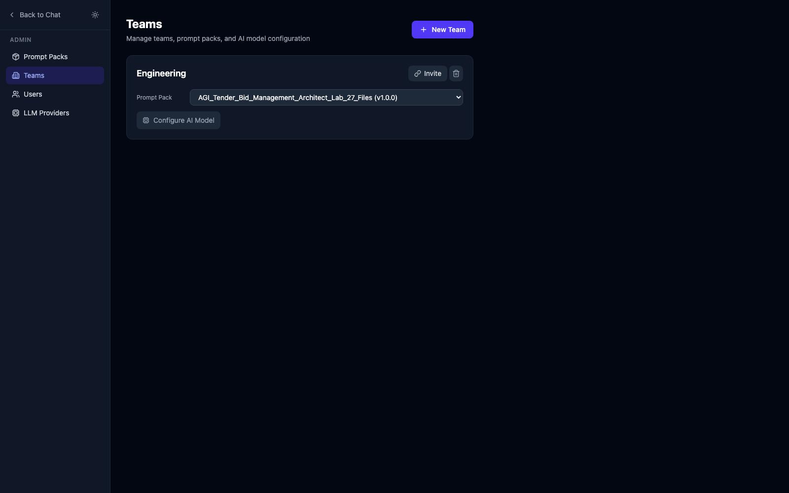 |

Captured locally against an OpenAI-compatible llama.cpp endpoint serving a Qwen model. Provider URL in screenshot is a placeholder; the real value is set per deployment via `Admin → LLM Providers → Add`.

---

## Sample Walkthrough

A real chat turn in the **Engineering** team using a 25-module Intercon prompt pack against a remote llama.cpp server.

### Setup state

- Team: `Engineering`
- Pack: `intercon-v2` (25 modules: 7 core, 12 domain, 6 mode overlays)
- Provider: `openai` type pointing at `https://llamacpp.example.com/v1`
- Model: `qwen3.5:27b` (262k ctx)
- Uploaded doc: `cold_chain_RFQ.pdf` (8 pages, parsed + chunked)

### User message

> *"Design an architecture for a cold-chain temperature sensor that uploads via LoRaWAN every 5 minutes, references the attached RFQ for constraints."*

### Trace (server timing in ms)

```
0ms     /api/chat/stream                User message hits SSE endpoint
3ms     Save user message               Persist to conversations table
15ms    Load team LLM config            Engineering → Ollama-compatible, qwen3.5:27b, 262k ctx
65ms    Provider /api/show              Confirm ctx size 262144 (cached after first call)
70ms    Load prompt pack                25 modules from DB
71ms    Classifier                      message keywords: "sensor", "LoRaWAN", "cold chain", "architecture"
                                        → mode = "design"
                                        → domains = ["embedded_iot"]
75ms    Compiler — assemble system prompt
        Core (always):
          00_START_HERE.md                priority=100  layer=core
          01_PROJECT_OVERVIEW.md          priority=100  layer=core
          02_HOUSE_RULES.md               priority=100  layer=core
          ...
        Always-append:
          16_ORG_CAPABILITY_MAP.md        priority=90   layer=always_append
        Domain (matched):
          17_EMBEDDED_IOT.md              priority=80   layer=domain (tags: sensor, lorawan, embedded)
        Mode overlay:
          modes["design"].prompt_text     → "Produce a layered architecture diagram + BOM + risk register..."
        Document context:
          cold_chain_RFQ.pdf              4 chunks (top-k semantic match), 1800 tokens
120ms   Token budget
        Assembled: 38,400 tokens (system) + 4,200 (history) + 1,800 (doc) = 44,400
        Target ctx: 262,144 → fits, no trim
122ms   Provider call                    qwen3.5:27b @ llamacpp endpoint, stream=true
...     SSE streaming back to client     chunks flushed to /api/chat/stream subscribers
8.4s    Stream complete                  ~3,200 output tokens
8.5s    Persist assistant message        conversations + messages tables
```

### Output (assistant response, abbreviated)

```markdown
# Cold-Chain Temperature Sensor — Architecture

## 1. Constraints (extracted from RFQ)
- Operating range: -40°C to +25°C
- Battery life: ≥ 3 years on 2× AA
- Compliance: WHO PQS E003/RF05
...

## 2. Hardware Block Diagram
| Block | Component | Rationale |
|---|---|---|
| Sensor | SHT45 | ±0.1°C, low power |
| MCU | STM32WL55 | Integrated LoRa, sub-mA sleep |
| Storage | 64Mbit SPI NOR | Buffer 90 days at 5-min interval |
...
## 3. Data Flow (LoRaWAN Class A)
...
## 4. Risk Register
...
## 5. Recommended Next Steps
```

### Why the output is structured this way

The output sections (Constraints, Block Diagram, Data Flow, Risk Register, Next Steps) come from `17_EMBEDDED_IOT.md` — the domain module loaded only because the classifier matched IoT keywords. A different team using the same model with a different pack gets a totally different shape.

The constraints come from `cold_chain_RFQ.pdf` because pgvector retrieval surfaced 4 chunks at compile time, injected before the assistant ever started reasoning. No "function call to read document" was needed.

### Export

User clicks **Export → DOCX**. Server:
1. Loads message markdown
2. mistune parses → AST
3. DOCX renderer walks AST, applies team template (heading styles, table styles, branding)
4. Returns `.docx` file

User opens in Word — sections are real Heading 1/2/3, table is a real Word table, code blocks are styled code.

### Debug — see compiled prompt

`POST /api/chat/debug-compile` with the same payload returns:
```json
{
  "system_prompt": "<full assembled text>",
  "loaded_modules": ["00_START_HERE.md", "01_PROJECT_OVERVIEW.md", "...", "17_EMBEDDED_IOT.md"],
  "mode": "design",
  "domains": ["embedded_iot"],
  "tokens": {"system": 38400, "history": 4200, "documents": 1800, "total": 44400, "ctx_limit": 262144},
  "trimmed": []
}
```

Useful when an assistant response disappoints — first place to look is whether the right modules loaded.

---

## Components

| Layer | Path | Role |
|---|---|---|
| Frontend | `frontend/src/` | React + Vite + Tailwind, TanStack Query |
| Backend entry | `backend/app/main.py` | FastAPI app |
| Auth | `backend/app/auth/` | JWT, users, teams, invites |
| Compiler | `backend/app/compiler/` | `classifier.py`, `compiler.py`, `budget.py` |
| Providers | `backend/app/providers/` | Anthropic, OpenAI, OpenRouter, Ollama |
| Documents | `backend/app/documents/` | Upload, parse, chunk, retrieve |
| Chat | `backend/app/chat/` | SSE streaming, conversation persistence |
| Export | `backend/app/export/` | Markdown → DOCX/PDF |
| Admin | `backend/app/admin/` | Pack CRUD, import/export ZIP, AI analyzer |
| Workers | `backend/app/workers/` | Celery tasks (doc processing) |
| DB migrations | `backend/alembic/` | Schema versioning |

---

## Quick Start

```bash
cd promptbase
cp .env.example .env
# edit .env — set at least one provider key OR Ollama URL

# 1. backend services
docker compose -f docker-compose.dev.yml up -d
# starts: api (8000), postgres+pgvector (5432), redis (6379), celery worker

# 2. migrations
docker compose -f docker-compose.dev.yml exec api alembic upgrade head

# 3. frontend
cd frontend && npm install && npm run dev
# open http://localhost:5173
```

First-run setup:
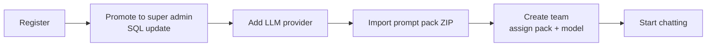

Super admin promotion:
```bash
docker compose -f docker-compose.dev.yml exec db \
  psql -U promptbase -c "UPDATE users SET is_super_admin = true WHERE email = 'you@x.com';"
```

---

## API Surface

| Group | Method | Endpoint |
|---|---|---|
| Auth | POST | `/api/auth/register` `/login` `/refresh` |
| Auth | GET | `/api/auth/me` `/teams` |
| Auth | POST | `/api/auth/teams` `/teams/{id}/invite` `/invite/{token}/accept` |
| Chat | POST | `/api/chat/stream` (SSE) `/debug-compile` |
| Chat | GET | `/api/chat/conversations/{team_id}` `/messages` |
| Docs | POST/GET/DEL | `/api/documents/{team_id}[/{id}]` |
| Export | GET | `/api/export/message/{id}?format=docx` `/conversation/{id}` |
| Admin | * | `/api/admin/{packs,modules,modes,providers,teams}` |

Full table in old README; see `app/main.py` route registration.

---

## Tech Stack

| Layer | Tech |
|---|---|
| Frontend | React 18, TS, Vite, Tailwind, TanStack Query |
| Backend | Python 3.12, FastAPI, SQLAlchemy 2.0 async, Celery |
| DB | PostgreSQL 16 + pgvector |
| Queue | Redis |
| LLMs | Ollama, OpenAI, Anthropic, OpenRouter |
| Doc parse | PyMuPDF, pdfplumber, python-docx |
| Export | python-docx, mistune, LibreOffice (PDF) |
| Deploy | Docker Compose |

---

## Why PromptBase (vs alternatives)

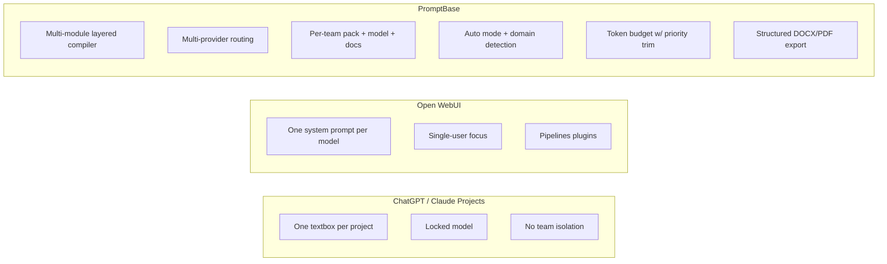

PromptBase is not a ChatGPT clone. The differentiator is: *"how do you make AI consistently follow a multi-file org instruction framework across teams and models, with context-aware routing per message?"*

---

## Prompt Pack Format

```
my_pack/
├── manifest.json
├── 00_START_HERE.md           # core
├── 01_PROJECT_OVERVIEW.md     # core
├── 16_ORG_CAPABILITY_MAP.md   # always_append
├── 17_EMBEDDED_IOT.md         # domain: embedded_iot
└── 18_BUSINESS_APPS.md        # domain: business_apps
```

```json
{
  "version": "2.0.0",
  "core": ["00_START_HERE.md", "01_PROJECT_OVERVIEW.md"],
  "always_append": ["16_ORG_CAPABILITY_MAP.md"],
  "domains": {
    "embedded_iot": ["17_EMBEDDED_IOT.md"],
    "business_apps": ["18_BUSINESS_APPS.md"]
  },
  "modes": [
    {"name": "analysis", "prompt_text": "Focus on gaps, risks..."},
    {"name": "implementation", "prompt_text": "Produce concrete steps..."}
  ]
}
```

Import via Admin → Prompt Packs → Import ZIP.

---

## Tests

```bash
cd backend && source .venv/bin/activate
pytest tests/ -v
# 41 tests: classifier, budget, compiler, provider registry, doc parser, chunker, DOCX renderer
```

---

## License

Internal use.
