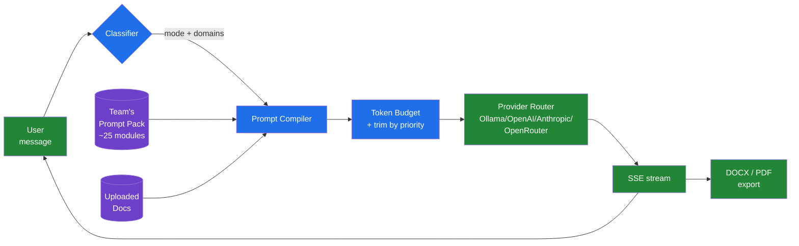
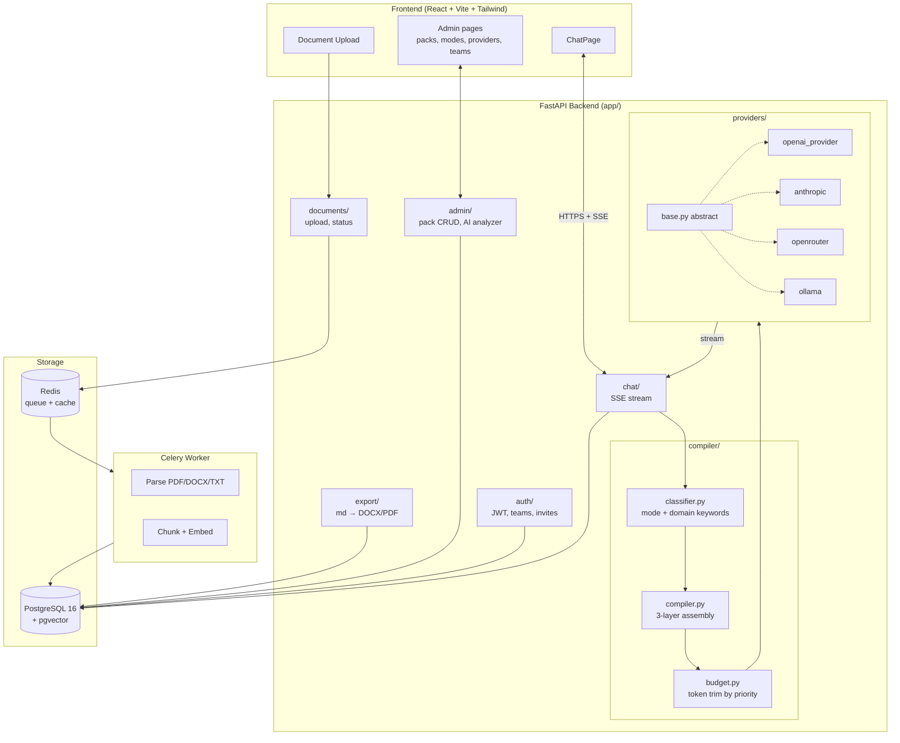
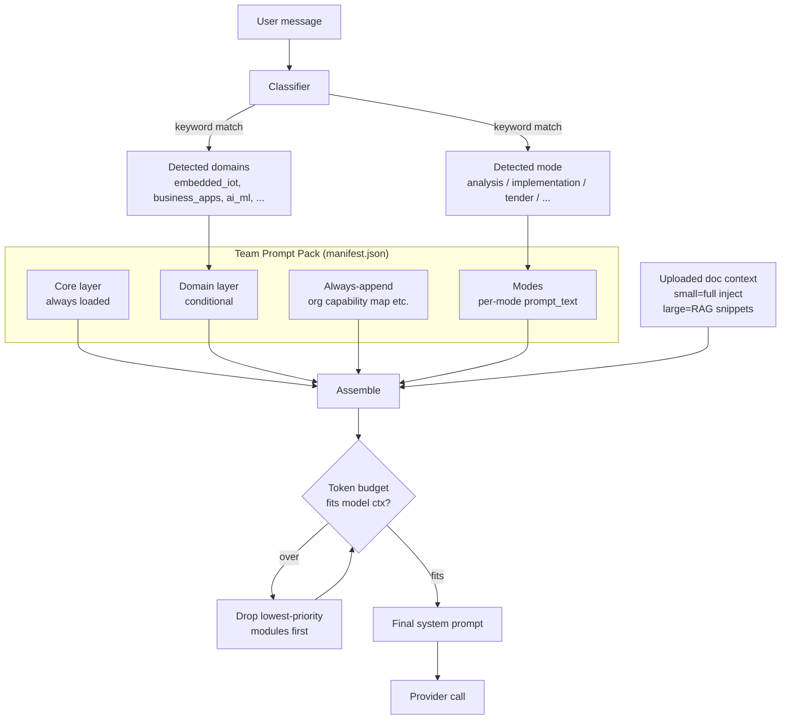
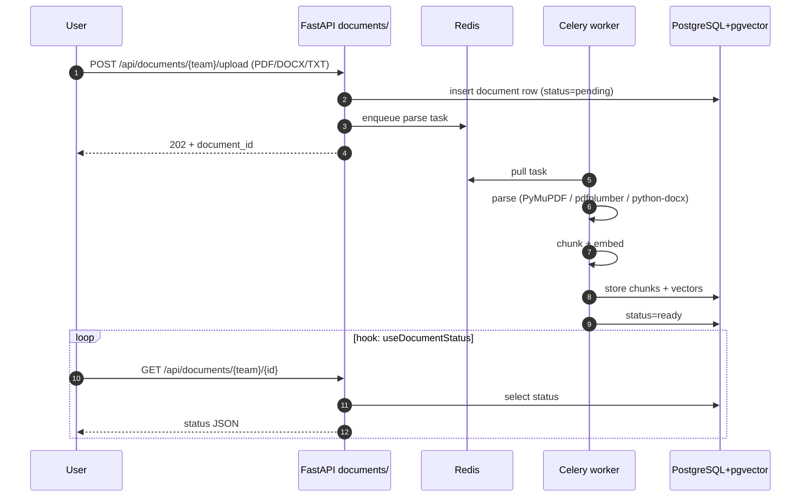
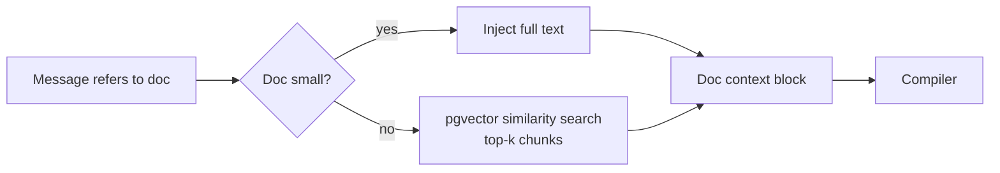
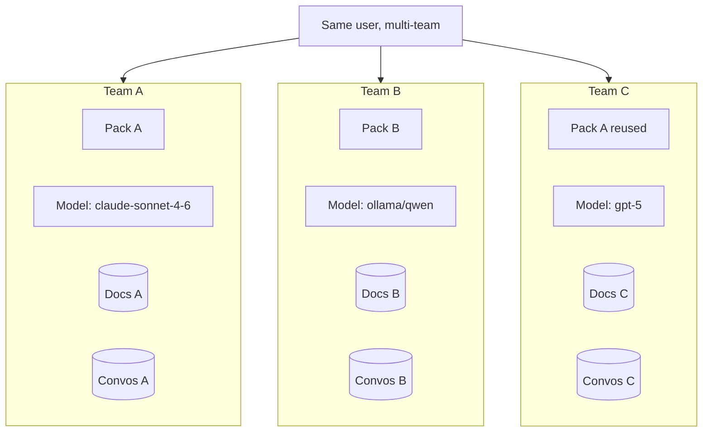
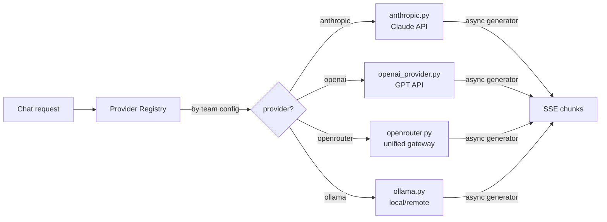
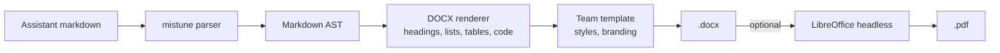
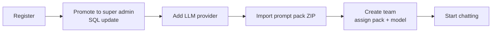
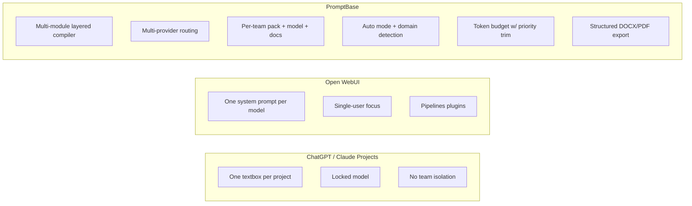

# PromptBase

Organizational prompt-pack platform. Compiles modular markdown instruction packs into per-request system prompts, routes to multiple LLM providers, and delivers structured Word/PDF output — per team, per model, per task.

Chat UI is the delivery surface. The product is the **compiler**.

---

## TL;DR



---

## System Architecture



---

## The Prompt Compiler

The unique part. Each chat turn rebuilds a fresh system prompt from the team's pack.



Module frontmatter drives the compiler:

```markdown
---
title: Embedded IoT Framework
tags: [plc, firmware, sensor, modbus]
priority: 80
layer: domain        # core | domain | always_append
---
```

---

## Document Pipeline



At chat time:


---

## Multi-Team Isolation



Each team has independent: pack assignment, LLM provider+model config, document library, conversation history.

---

## Provider Routing



Each provider implements the same `base.py` interface: `stream(messages, model, **kwargs) -> AsyncIterator[str]`. Adding a provider = one new file + register.

---

## Export Pipeline



---

## Components

| Layer | Path | Role |
|---|---|---|
| Frontend | `frontend/src/` | React + Vite + Tailwind, TanStack Query |
| Backend entry | `backend/app/main.py` | FastAPI app |
| Auth | `backend/app/auth/` | JWT, users, teams, invites |
| Compiler | `backend/app/compiler/` | `classifier.py`, `compiler.py`, `budget.py` |
| Providers | `backend/app/providers/` | Anthropic, OpenAI, OpenRouter, Ollama |
| Documents | `backend/app/documents/` | Upload, parse, chunk, retrieve |
| Chat | `backend/app/chat/` | SSE streaming, conversation persistence |
| Export | `backend/app/export/` | Markdown → DOCX/PDF |
| Admin | `backend/app/admin/` | Pack CRUD, import/export ZIP, AI analyzer |
| Workers | `backend/app/workers/` | Celery tasks (doc processing) |
| DB migrations | `backend/alembic/` | Schema versioning |

---

## Quick Start

```bash
cd promptbase
cp .env.example .env
# edit .env — set at least one provider key OR Ollama URL

# 1. backend services
docker compose -f docker-compose.dev.yml up -d
# starts: api (8000), postgres+pgvector (5432), redis (6379), celery worker

# 2. migrations
docker compose -f docker-compose.dev.yml exec api alembic upgrade head

# 3. frontend
cd frontend && npm install && npm run dev
# open http://localhost:5173
```

First-run setup:


Super admin promotion:
```bash
docker compose -f docker-compose.dev.yml exec db \
  psql -U promptbase -c "UPDATE users SET is_super_admin = true WHERE email = 'you@x.com';"
```

---

## API Surface

| Group | Method | Endpoint |
|---|---|---|
| Auth | POST | `/api/auth/register` `/login` `/refresh` |
| Auth | GET | `/api/auth/me` `/teams` |
| Auth | POST | `/api/auth/teams` `/teams/{id}/invite` `/invite/{token}/accept` |
| Chat | POST | `/api/chat/stream` (SSE) `/debug-compile` |
| Chat | GET | `/api/chat/conversations/{team_id}` `/messages` |
| Docs | POST/GET/DEL | `/api/documents/{team_id}[/{id}]` |
| Export | GET | `/api/export/message/{id}?format=docx` `/conversation/{id}` |
| Admin | * | `/api/admin/{packs,modules,modes,providers,teams}` |

Full table in old README; see `app/main.py` route registration.

---

## Tech Stack

| Layer | Tech |
|---|---|
| Frontend | React 18, TS, Vite, Tailwind, TanStack Query |
| Backend | Python 3.12, FastAPI, SQLAlchemy 2.0 async, Celery |
| DB | PostgreSQL 16 + pgvector |
| Queue | Redis |
| LLMs | Ollama, OpenAI, Anthropic, OpenRouter |
| Doc parse | PyMuPDF, pdfplumber, python-docx |
| Export | python-docx, mistune, LibreOffice (PDF) |
| Deploy | Docker Compose |

---

## Why PromptBase (vs alternatives)



PromptBase is not a ChatGPT clone. The differentiator is: *"how do you make AI consistently follow a multi-file org instruction framework across teams and models, with context-aware routing per message?"*

---

## Prompt Pack Format

```
my_pack/
├── manifest.json
├── 00_START_HERE.md           # core
├── 01_PROJECT_OVERVIEW.md     # core
├── 16_ORG_CAPABILITY_MAP.md   # always_append
├── 17_EMBEDDED_IOT.md         # domain: embedded_iot
└── 18_BUSINESS_APPS.md        # domain: business_apps
```

```json
{
  "version": "2.0.0",
  "core": ["00_START_HERE.md", "01_PROJECT_OVERVIEW.md"],
  "always_append": ["16_ORG_CAPABILITY_MAP.md"],
  "domains": {
    "embedded_iot": ["17_EMBEDDED_IOT.md"],
    "business_apps": ["18_BUSINESS_APPS.md"]
  },
  "modes": [
    {"name": "analysis", "prompt_text": "Focus on gaps, risks..."},
    {"name": "implementation", "prompt_text": "Produce concrete steps..."}
  ]
}
```

Import via Admin → Prompt Packs → Import ZIP.

---

## Tests

```bash
cd backend && source .venv/bin/activate
pytest tests/ -v
# 41 tests: classifier, budget, compiler, provider registry, doc parser, chunker, DOCX renderer
```

---

## License

Internal use.
